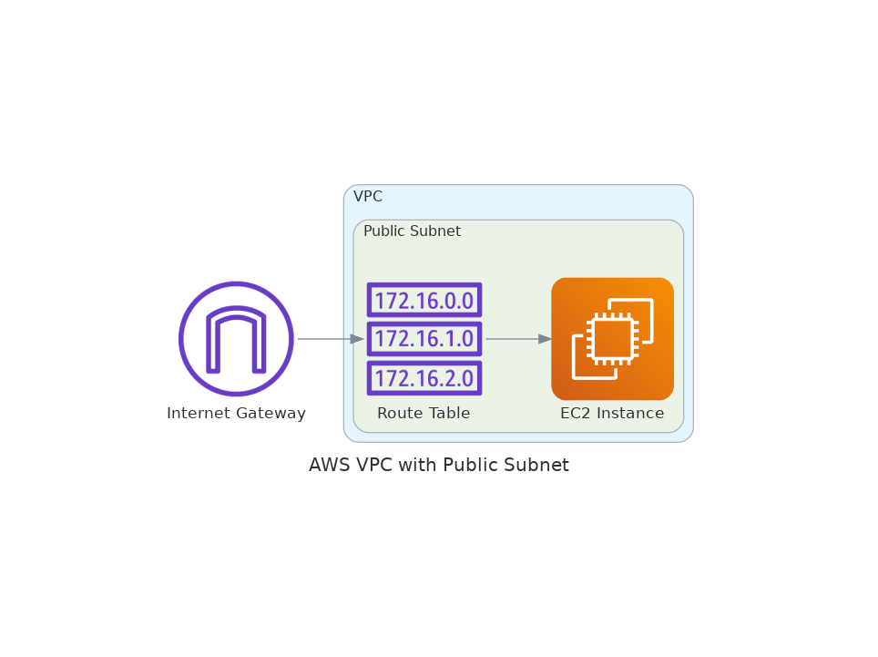
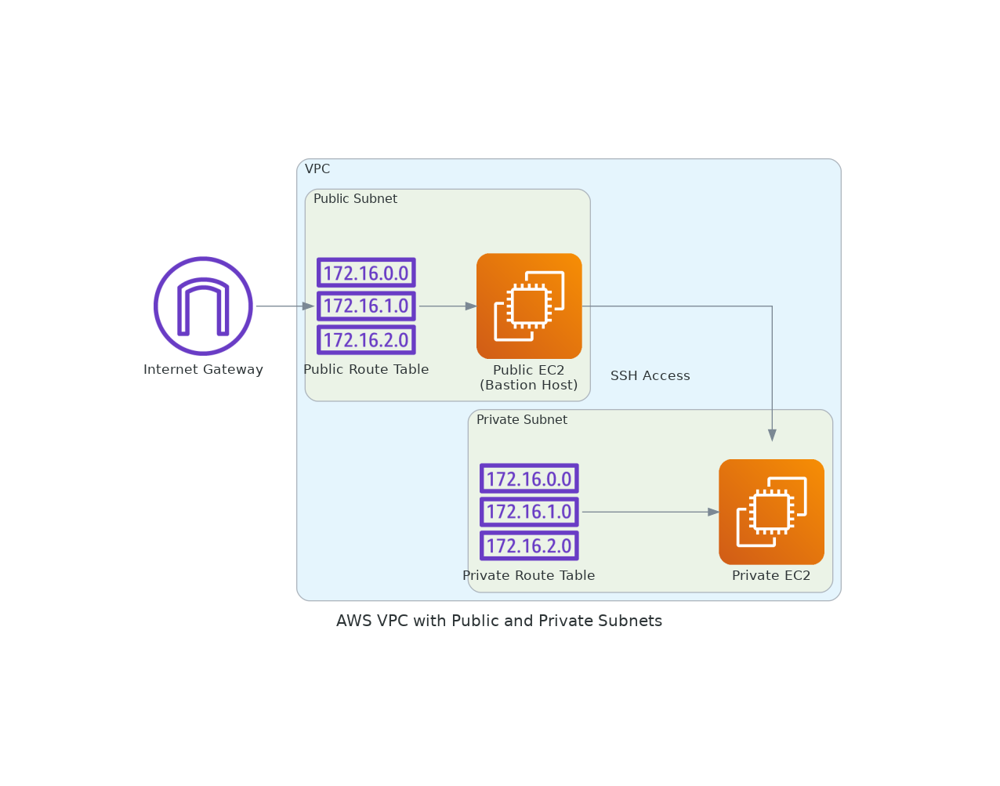
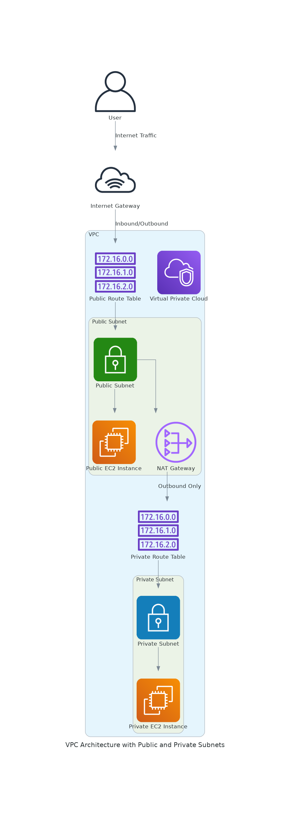
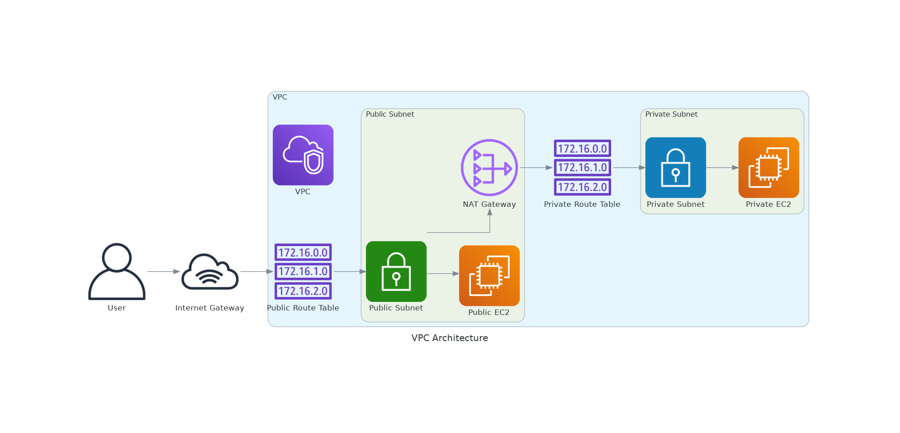
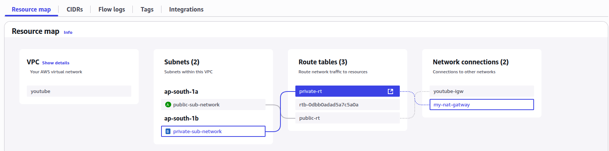

# AWS VPC Architecture Diagrams

---

## Diagram 1 📘

The diagram shows a simple AWS architecture with the following components:

- **VPC (Virtual Private Cloud)** – The outer blue container representing an isolated network environment in AWS.
- **Public Subnet** – A subnet within the VPC that has direct access to the internet.
- **EC2 Instance** – A virtual server (shown in orange) running within the public subnet.
- **Route Table** – Contains routing rules (`172.16.0.0`, `172.16.1.0`, `172.16.2.0`) that determine where network traffic is directed.
- **Internet Gateway** – The purple gateway icon on the left that allows communication between the VPC and the internet.

**Flow:**
1. The Internet Gateway connects to the Route Table  
2. The Route Table connects to the EC2 Instance  

---

## Diagram 2 🔐

The diagram shows an AWS VPC architecture with public and private subnets:

- **VPC (Virtual Private Cloud)** – The outer light-blue container representing an isolated network environment in AWS.
- **Public Subnet** contains:
  - Public Route Table (with routes `172.16.0.0`, `172.16.1.0`, `172.16.2.0`)
  - Public EC2 instance labeled **"Bastion Host"**
- **Private Subnet** contains:
  - Private Route Table (same routes as above)
  - Private EC2 instance
- **Internet Gateway** – Purple gateway icon enabling internet connectivity.

**Connectivity flow:**
- Internet Gateway → Public Route Table → Public EC2 instance  
- Public EC2 → Private EC2 (via SSH Access)  
- Private Route Table → Private EC2 instance

This setup follows a best-practice security pattern:
- Public subnet has direct internet access via the Internet Gateway
- Private subnet has no direct internet exposure
- The bastion host in the public subnet allows secure SSH access into the private subnet

---

## Diagram 3 🌐
*note:- ip only allocate the nat gatway*

I've created this VPC architecture diagram to illustrate the following setup:

1. **VPC** containing:
   - Two subnets (public + private)
   - Route tables for each subnet
   - Network connectivity components

2. **Public Subnet** includes:
   - A public EC2 instance (internet-accessible)
   - A NAT Gateway enabling outbound access for private subnet

3. **Private Subnet** includes:
   - A private EC2 instance (no direct inbound internet access)

4. **Networking components:**
   - Internet Gateway attached to the VPC
   - Public Route Table (`172.16.0.0`, `172.16.1.0`, `172.16.2.0`)
   - Private Route Table (same route ranges)
   - NAT Gateway in the public subnet for private outbound traffic

5. **Traffic Flow:**
   1. User request → Internet Gateway  
   2. → Public Route Table → Public Subnet → Public EC2  
   3. → NAT Gateway → Private Subnet → Private EC2 (outbound internet only via NAT Gateway)
